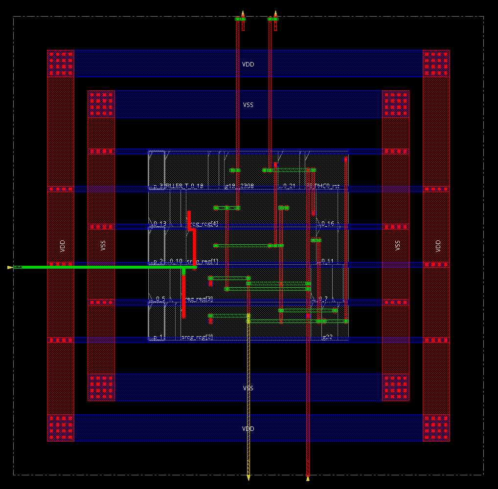
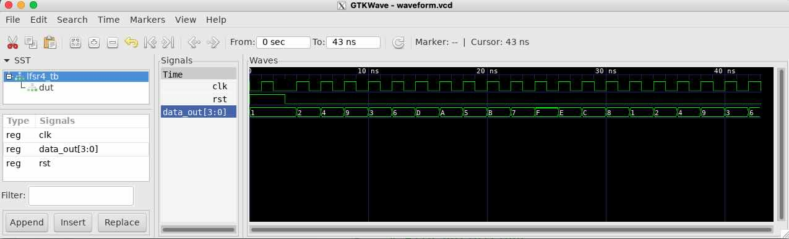
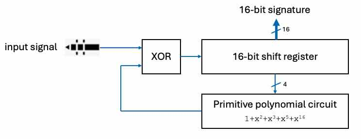

##### Imperial College London, Department of Electrical & Electronic Engineering


#### ELEC70142 Digital VLSI Design

### Lab 1 - A Quick Start with Cadence

##### *Peter Cheung, v0.2 - 2 October 2025*

---
### Objectives
---
By the end of this laboratory session, you should be able to do the following.
* Set up your personal laptop environment for **Cadence EDA software** running on our teaching servers.
* Use **_Genus_** EDA package to synthesize a simple circuit from **HDL to standard cells**.
* Understand the **steps required** to take a RTL specification to silicon using standard cells. 
* Interpret the **timing** and **size estimates** reported by *Genus*.
* Use **_Innovus_** EDA package to **place and route** the synthesized circuit. 
* Understand how to write a **Tcl script** to perform synthesis and place-and-route.
* Perform basic **Design Rule Check** (DRC) and **layout verification check** (LVS) on the circuit.
* Use **_Xcelium_** simulator to **verify** that synthesised and place-and-routed circuit works.
* Use **_GTKwave_** to inspect simulation results.
* Inspect the resulting **silicon layout** of the circuit.

---
### Before you start
---

>Before you even start this laboratory session, you must have signed the TSMC's **non-disclosure agreement (NDA)**, and have returned this to me.  Remember that you MUST abide by the restrictions stipulated in the NDA.

Although you could use the PCs provided by the Department in Room 507 for this lab, I recommend that you  bring your own laptop.  There are many displays units in the room for you to plug in your laptop and use a larger screen for this lab. You will be working in pairs. 

If you are using a Windows PC, you will need to have [MobaXterm]([https://mobaxterm.mobatek.net) installed. This provides a feature-rich terminal environment with built-in X server and ssh client.

If you are a MacBook user, you already have the Terminal applicatio as part of OSX. You also need to install [XQuartz](https://www.xquartz.org) X server to run Cadence.

---
### Task 1 - Connect to the Teaching Server
---

To access Imperial College's resources from your personal laptop, you will need to connect to the Universal Access provision after running [Zscaler](https://uafiles.cc.ic.ac.uk/). After authentication, you will be able to access file systems and computer servers.

Cadence is installed and runs on the EEE teaching servers, which you access via SSH. There are two
 servers available:

* ee-mill1.ee.ic.ac.uk
* ee-mill2.ee.ic.ac.uk

For **Windows**: Use [MobaXterm]([https://mobaxterm.mobatek.net) to create a new session by entering the server address with your username and password.

For **Mac**: Use [XQuartz](https://www.xquartz.org). After installation and opening XQuartz, enter:
```bash
ssh -Y <username>@ee-mill1.ee.ic.ac.uk
```
or
```bash
ssh -Y <username>@ee-mill2.ee.ic.ac.uk
```
Once you have logon, create your directory structure for this module's coursework, e.g. Lab_1, Lab_2 etc..   Within Lab_1, create the following folders to store the various types of files created or generated for this lab:
* **SRC** - where you put the HDL sources
* **OUTPUTS** - where all generated files from sythesis are stored
* **REPORTS** - where all reports are stored
* **SAVES** - where incomplete designs are saved for incremental development
  
Using your favourite editor, create the following SystemVerilog HDL source *_lfsr4.sv_* in the **SRC** folder. This is a 4-bit linear feedback register used in 2nd year labs.

```v
module lfsr4 (
    // simple 4-bit linear feedback shift register.
    // primitive polynomial is x^4 + x^3 + 1
    // Author: Peter YK Cheung
    // Version: 1.0, 17-9-25
  input logic clk,        // clock
  input logic rst,        // reset
  output logic [3:0]  data_out    // pseudo-random output
);
  logic [4:1]     sreg;
  always_ff @ (posedge clk, posedge rst)
    if (rst)
      sreg <= 4'b1;
    else 
	    sreg <= {sreg[3:1], sreg[3] ^ sreg[4]};
  assign data_out = sreg;
endmodule 
```

---
### Task 2 - Sythesize RTL to Standard Cells
---

**_Step 1: Specify the PDK for your design_**

In this task, you will learn how to implement the LFSR circuit using TSMC 65nm standard cells.  Before you start, you need to specify which **_process design kit (PDK)_** you will be using. 

Move to the Lab 1 directory and enter:

```bash
pdk
```
This will show you all the PDKs available on the server.  Choose the TSMC 65nm low power process PDK by enter:
```bash
pdk tsmc65LP
```
> The *_pdk_* command must be run every time before you run your **_first_** Cadence EDA tool.  This sets up the environmental variables required by Cadence tools, and you are set up to use the TSMC 65nm lower power process thereafter.
> 
**_Step 2: Launching the Genus tool_**

Cadence Genus tool synthesizes your RTL specification in SystemVerilog into optimized gate-level netlist. The output is a Verilog specifications of gates (in our case, standard cells) which can be implemented as silicon layout through a placement and routing process later (called PnR).

Launch Genus by typing:
```bash
genus
```

When you see the prompt **_@genus:rool: 1\>_**, you are inside the Genus tool environment.  

Genus accepts **_Tcl_** scripts (**T**ool **C**ommand **L**anguage).  While you may want to learn Tcl for personal interest, you are not going to use any complex syntax of Tcl in this lab.  If you want to find out more about Tcl, 
here are some useful resources:

* a [tutorial video](https://www.youtube.com/watch?v=o_mhSa5HQCc) on Tcl;
* an 3-page [online tutorial](https://www.asic-world.com/scripting/tcl1.html);
* a comprehensive [cheatsheet](https://cheatography.com/aha/cheat-sheets/tcl-language/).
  
**_Step 3: Set various environment variables and design name_**

Enter these Tcl commands in Genus:
```tcl
# Variable setup
set _HDL_DIRECTORY ./SRC
set HDL_FILES [list lfsr4.sv]           ;* list of sources
set DESIGN lfsr4                        ;* top-level module name

# Clock name should match the clock signal name in HDL (i.e. clk, CLK, ...)
set CLOCK_NAME clk
set CLOCK_PERIOD_ps 1000

set GEN_EFF medium                      ;# synthesis effort
set MAP_OPT_EFF high                    ;# mapping and optimization effort

set _OUTPUTS_PATH OUTPUTS               ;# where to store output files
set _REPORTS_PATH REPORTS               ;# where to store synthesis reports
```
Copy and paste these Tcl commands directly into Genus. (Use the copy icon on top right corner of code.)  Make sure that you know what each Tcl command does.

**_Step 4: Specify where the standard cell libraries can be found_**

Enter these Tcl commands in Genus:

```tcl
set_db init_hdl_search_path $_HDL_DIRECTORY;
set_db library "/usr/local/cadence/kits/tsmc/beLibs/65nm/TSMCHOME/digital/Front_End/timing_power_noise/NLDM/tcbn65lpbwp7t_220a/tcbn65lpbwp7twc.lib";
set_db lef_library "/usr/local/cadence/kits/tsmc/beLibs/65nm/TSMCHOME/digital/Back_End/lef/tcbn65lpbwp7t_141a/lef/tcbn65lpbwp7t_9lmT2.lef";
set_db cap_table_file "/usr/local/cadence/kits/tsmc/beLibs/65nm/TSMCHOME/digital/Back_End/lef/tcbn65lpbwp7t_141a/techfiles/captable/cln65lp_1p09m+alrdl_top2_rcworst.captable";
set_db information_level 4;       # Output verbosity level - 1 (default) to 11
set_db use_tiehilo_for_const duplicate;
```

**_Step 5: Load the design and specify the clock signal & constraints_**

Enter these Tcl commands in Genus:

```tcl
# Load the design and check basic syntax
read_hdl -sv ${HDL_FILES}
elaborate ${DESIGN}
check_design -unresolved
check_design -unloaded

# Set time units for SDC commands to be consistent with Genus commands
set_time_unit -picoseconds
set_load_unit -femtofarads

# Tell Genus about the clock signal
create_clock -domain domain1 -name ${CLOCK_NAME} -period ${CLOCK_PERIOD_ps} [get_db ports ${CLOCK_NAME}]
set_db clock:${DESIGN}/${CLOCK_NAME} .setup_uncertainty [expr 0.02 * ${CLOCK_PERIOD_ps}]
set_clock_uncertainty -hold  [expr 0.02 * ${CLOCK_PERIOD_ps}] ${CLOCK_NAME} 
set_clock_uncertainty -setup [expr 0.02 * ${CLOCK_PERIOD_ps}] ${CLOCK_NAME} 
set_clock_transition -rise  50 ${CLOCK_NAME}
set_clock_transition -fall  50 ${CLOCK_NAME}

# Define the system clock constraints
create_clock -domain domain1 -name ${CLOCK_NAME} -period ${CLOCK_PERIOD_ps} [get_db ports ${CLOCK_NAME}]
set_db clock:${DESIGN}/${CLOCK_NAME} .setup_uncertainty [expr 0.02 * ${CLOCK_PERIOD_ps}]
set_clock_uncertainty -hold  [expr 0.02 * ${CLOCK_PERIOD_ps}] ${CLOCK_NAME} 
set_clock_uncertainty -setup [expr 0.02 * ${CLOCK_PERIOD_ps}] ${CLOCK_NAME} 
set_clock_transition -rise  50 ${CLOCK_NAME}
set_clock_transition -fall  50 ${CLOCK_NAME}
```
These clock specifications are necessary for Genus' synthesis and optimization algorithms to try meet the timing requirements.

**_Step 6: Synthesis to gates_**

Enter these Tcl commands in Genus:
```tcl
# First synthesize to generic gates
set_db syn_generic_effort $GEN_EFF
syn_generic

# Then map to TSMC standard cells
set_db syn_map_effort $MAP_OPT_EFF
syn_map

write_snapshot -directory ${_REPORTS_PATH}/map -tag map
report_dp > ${_REPORTS_PATH}/map/${DESIGN}_datapath.rpt
report_summary -directory ${_REPORTS_PATH}
```
When you copy and paste these commands to Genus, you should examine the ./OUTPUTS and ./REPORTS folder to see what have been generated.

Note that you will also see a large number of warning messages.  Ignore them for now - they have no material impact on the sythesis results.

**_Step 7: Optimize the netlist and write all reports and output files_**

Enter these Tcl commands in Genus:
```tcl
# Optimize netlist
set_db syn_opt_effort $MAP_OPT_EFF
syn_opt
write_snapshot -directory ${_REPORTS_PATH}/opt -tag syn_opt
report_dp > ${_REPORTS_PATH}/opt/${DESIGN}_datapath.rpt
report_summary -directory ${_REPORTS_PATH}

# Export Design Files
write_snapshot -directory ${_REPORTS_PATH}/final -tag final
report_summary -directory ${_REPORTS_PATH}
write_hdl > ${_OUTPUTS_PATH}/${DESIGN}_synth.v
write_sdc > ${_OUTPUTS_PATH}/${DESIGN}_synth.sdc
write_sdf > ${_OUTPUTS_PATH}/${DESIGN}_synth.sdf
write_script > ${_OUTPUTS_PATH}/${DESIGN}.script
write_design -base_name ${_OUTPUTS_PATH}/DESIGN/${DESIGN}_synth
write_db -all_root_attributes -script ${_OUTPUTS_PATH}/DESIGN/${DESIGN}_synth.tcl    

# Write reports
report_qor > ${_REPORTS_PATH}/${DESIGN}_qor.rpt
report_area > ${_REPORTS_PATH}/${DESIGN}_area.rpt
report_dp > ${_REPORTS_PATH}/${DESIGN}_datapath_incr.rpt
report_messages > ${_REPORTS_PATH}/${DESIGN}_messages.rpt
report_gates > ${_REPORTS_PATH}/${DESIGN}_gates.rpt
report_timing > ${_REPORTS_PATH}/${DESIGN}_timing.rpt
report_power > ${_REPORTS_PATH}/${DESIGN}_power.rpt
```
Congratulations!  You have managed to synthesize your HDL design into gates

> * Identify the synthesized circuit from the OUTPUTS directory.
> * Examine the sytnesized Verilog file and be satisfied that it is what you expected.
> * What are the standard cells used, and how many?
> * Have a look at some of the report files.

**_Step 8: Finishing the synthesis task_**

* Use the exit command to leave Genus tool.

* Create in the Lab 1 folder the Tcl script **_synth.tcl_** that combines ALL the Tcl commands above. 
* Launch Genus again and re-run the synthesis process with the *_synth.tcl_* script as one command:
```tcl
source synth.tcl
```
You should produce the same result as that after step 7.

> From now on, you can run this script after you made changes to your desing.  Further, you can use this script as template to synthesize other new designs.

---
### Task 3 - Place and Route the standard cells
---
In this task, you will use **_Innovus_**, Cadence's place-and-route (PnR) tools, to produce the physical layout of your **_lfsr4_** design.  If you are using a Mac, you must have **_XQuartz_** running on your laptop for this to work.  For PC users, **_MobaXterm_** has the X server built in.

The place and route procedure consists of many steps.  After each step, *_Innovus_* displays the latest progress in the form of chip layout in a separate graphical window.  To understand what each PnR steps does, you are recommended to perform each step separately, and record what you discover from both the layout window and from the terminal window.  This will help you appreciate what each PnR step does, and how to debug problems when you design a more complex circuit later.

**_Step 1: Create the MMMC (Multi-Mode, Multi-Corner) file_**

Before we can perform PnR, we need to tell the tools the operating mode of the chip (e.g. normal or sleep) and the worst-case conditions (corners) the chip operate under (e.g. temperature, supply voltage), as well as timing constraints. This is done by specifying an **_mmmc_timing.tcl_** script.  Don't worry too much about the detail commands for now - topics of timing closure, impact of PVT (process, voltage, temperature) in VLSI design will be discuss in later lectures.

Create (or copy) this file in your design folder.

```tcl
####################################################################
## MMMC Timing Constraints Setup
####################################################################
# Creation of the multi-mode multi-corner analysis view for the design.
# First load the SDC file contains the timing constraints for the design.
# then set the timing library for the standard cells and I/O cells. There are three
# delay corners: best, worst, and typical. The typical corner is used for functional analysis.
# Then create the RC corner for the design, which includes the capacitance table and temperature.
# Finally, create the delay corner constraints and the analysis view for the design.


create_constraint_mode -name CONSTRAINTS -sdc_files ${SDC_FILE}
create_library_set -name libs_typ -timing { \
        "/usr/local/cadence/kits/tsmc/beLibs/65nm/TSMCHOME/digital/Front_End/timing_power_noise/NLDM/tcbn65lpbwp7t_220a/tcbn65lpbwp7twc.lib" \
        "/usr/local/cadence/kits/tsmc/beLibs/65nm/TSMCHOME/digital/Front_End/timing_power_noise/NLDM/tphn65lpnv2od3_sl_200b/tphn65lpnv2od3_sltc.lib" \
        "/usr/local/cadence/kits/tsmc/beLibs/65nm/TSMCHOME/digital/Front_End/timing_power_noise/NLDM/tphn65lpnv2od3_sl_200b/tphn65lpnv2od3_sltc1.lib"\
        "/usr/local/cadence/kits/tsmc/beLibs/65nm/TSMCHOME/digital/Front_End/timing_power_noise/NLDM/tphn65lpnv2od3_sl_200b/tphn65lpnv2od3_sltc2.lib"\
        "/usr/local/cadence/kits/tsmc/beLibs/65nm/TSMCHOME/digital/Front_End/timing_power_noise/NLDM/tphn65lpnv2od3_sl_200b/tphn65lpnv2od3_sltc3.lib"\
        "/usr/local/cadence/kits/tsmc/beLibs/65nm/TSMCHOME/digital/Front_End/timing_power_noise/NLDM/tphn65lpnv2od3_sl_200b/tphn65lpnv2od3_sltc4.lib"\
    }
create_rc_corner -name tsmc65_rc_corner_typ \
            -cap_table {/usr/local/cadence/kits/tsmc/beLibs/65nm/TSMCHOME/digital/Back_End/lef/tcbn65lpbwp7t_141a/techfiles/captable/cln65lp_1p09m+alrdl_top2_typical.captable} \
            -T 25 
create_delay_corner -name corner_typ -library_set {libs_typ} -rc_corner {tsmc65_rc_corner_typ}
create_analysis_view -name {functional_typ} -delay_corner {corner_typ} -constraint_mode {CONSTRAINTS} 
set_analysis_view -setup {functional_typ} -hold {functional_typ}
```

Launch **Innovus** by entering:
```bash
innovus 
```

**_Step 2: Set up variables_**

We first set up the relevent variables for *_Innovus_*.  The key parameters here are those that define properties of the standard cell core and the power ring sizes.

```tcl
#Top-level module name
set DESIGN lfsr4                                  ;# top-level module name            
set VERILOG_FILES [list OUTPUTS/lfsr4_synth.v]    ;# output synthsis task
set SDC_FILE OUTPUTS/lfsr4_synth.sdc              ;# specify constraints for PnR

# Set Floorplan parameters (unit in um)
set CORE_ASPECT_RATIO 1.0                         ;# square layout
set CORE_UTILIZATION 0.6                          ;# 40% for routing of signal & power
set COREGAP 5                                     ;# gap from power ring to core

# Set Power Ring parameters (in um)
# The power ring is a rectangular area around the core that provides power and ground connections.
set POWER_RING_WIDTH 1                            ;# width of wire
set POWER_RING_SPACING 0.5                         ;# spacing between wires
set POWER_RING_OFFSET 0.5                          ;# distance from core boundary

# Setup PnR environment and say where library can be found
set init_verilog ${VERILOG_FILES}
set init_top_cell ${DESIGN}
set init_lef_file { \
    /usr/local/cadence/kits/tsmc/beLibs/65nm/TSMCHOME/digital/Back_End/lef/tcbn65lpbwp7t_141a/lef/tcbn65lpbwp7t_9lmT2.lef \
    /usr/local/cadence/kits/tsmc/beLibs/65nm/TSMCHOME/digital/Back_End/lef/tphn65lpnv2od3_sl_200b/mt_2/9lm/lef/tphn65lpnv2od3_sl_9lm.lef \
    /usr/local/cadence/kits/tsmc/beLibs/65nm/TSMCHOME/digital/Back_End/lef/tpbn65v_200b/wb/9m/9M_6X2Z/lef/tpbn65v_9lm.lef \
    }                                             ;# use these abstract standard cell for PnR
set init_mmmc_file "./mmmc_timing.tcl"            ;# specify corner conditions the chip operates under (i.e. temperature, voltages etc.)
set init_gnd_net {VSS}
set init_pwr_net {VDD}

setDesignMode -process 65
init_design
```
> What is the result of this PnR step?


**_Step 3: Floor Planning_**

Enter these Tcl command:
```tcl
# Plan how the overall layout, particularly where power wires go
floorplan -r ${CORE_ASPECT_RATIO} ${CORE_UTILIZATION} ${COREGAP} ${COREGAP} ${COREGAP} ${COREGAP} 
globalNetConnect VSS -type pgpin -pin VSS -all -override
globalNetConnect VDD -type pgpin -pin VDD -all -override
globalNetConnect VDD -type tiehi -pin VDD -all -override
globalNetConnect VSS -type tielo -pin VSS -all -override

# Add power ring
addRing -width ${POWER_RING_WIDTH} -spacing ${POWER_RING_SPACING} -offset ${POWER_RING_OFFSET} -layer {top M1 bottom M1 left M2 right M2} -center 1 -nets {VSS VDD}

# Special routing for power and ground nets
sroute -nets {VSS VDD} -allowJogging true -allowLayerChange true -blockPin useLef -connect {blockPin padPin padRing corePin floatingStripe}

# Insert well taps to prevent latch up
addWellTap -cell TAPCELLBWP7T -prefix welltap -cellInterval 60 -checkerBoard

timeDesign -prePlace -expandedViews -outDir ./REPORTS/prePlace -prefix prePlace
```
You should see graphical information on the layout window. Use the 'f' key to fit the entire core onto the window.

> What is the result of this floorplanning step?  What are *_well taps_* and why are they needed?

**_Step 4: Placement_**

This step places the standard cells specified in the synthesized netlist such that various constraints such as aspect ratio and how much of the core area is used up are met.  This step also performs preliminary check on timing constraints specified earlier based on the timing properties of the standard cells used.

```tcl
# Placement 
setPlaceMode -place_global_place_io_pins true 
place_opt_design 
setTieHiLoMode -maxFanout 10 -maxDistance 50
addTieHiLo -cell "TIEHBWP7T TIELBWP7T" 
timeDesign -preCTS -outDir REPORTS/preCTS -prefix preCTS
```
> What is the results of this placement step?

**_Step 5: Clock tree insertion_**

To meet the timing requirements of a synchronous circuit, a well designed clock tree circuit is vital.  Details of clock tree design will be covered in a later lecture.  *_Innovus_* provides a clock tree synthesis (CTS) tool. Routing and buffer sizing of the clock tree is done before the finally routing.  This is achieved by the following.

```tcl
# specify clock properties
set_ccopt_property buffer_cells {CKBD0BWP7T CKBD1BWP7T CKBD2BWP7T CKBD3BWP7T CKBD4BWP7T CKBD6BWP7T CKBD8BWP7T CKBD10BWP7T CKBD12BWP7T}
set_ccopt_property inverter_cells {CKND0BWP7T CKND1BWP7T CKND2BWP7T CKND3BWP7T CKND4BWP7T CKND6BWP7T CKND8BWP7T CKND10BWP7T CKND12BWP7T}
set_ccopt_property target_max_trans 130ps
set_ccopt_property target_skew 200ps
set_ccopt_property max_fanout 20

setOptMode -usefulSkew true
setOptMode -usefulSkewCCOpt extreme

# clock tree synthesis (CTS)
create_ccopt_clock_tree_spec -file REPORTS/ctsspec.tcl
source REPORTS/ctsspec.tcl
ccopt_design -check_prerequisites
ccopt_design

# post clock tree sythesis optimization
optDesign -postCTS -setup -hold -outDir REPORTS/postCTSOptTiming
timeDesign -postCTS -expandedViews -outDir REPORTS/postCTS -prefix postCTS
report_ccopt_clock_trees -file REPORTS/postCTS/clock_trees.rpt
report_ccopt_skew_groups -file REPORTS/postCTS/skew_groups.rpt
```
> What is the result of clock tree insertion?

**_Step 6: Routing_**
```tcl
routeDesign                         ;# this does the routing
## Set analysis on on-chip variation (OCV) mode 
setAnalysisMode -analysisType onChipVariation -skew true -clockPropagation sdcControl
optDesign -postRoute -setup
optDesign -postRoute -hold
```
**_Step 7: Finishing  up_**

```tcl
# Add filler cells to fill gaps 
addFiller -cell {FILL1BWP7T FILL2BWP7T FILL4BWP7T FILL8BWP7T FILL16BWP7T FILL32BWP7T FILL64BWP7T} -doDRC

# perform basic DRC and LVS
verifyConnectivity
verify_drc -limit 100000
timeDesign -postRoute -expandedViews -outDir REPORTS/postRoute -prefix postRoute

## Saving the design
saveDesign ./SAVES/${DESIGN}_done.enc

# Export Design

## Export final netlist to Verilog format
saveNetlist OUTPUTS/[format "%s_soc.v" $DESIGN]

## Export delay information to SDF format
write_sdf OUTPUTS/${DESIGN}.sdf 

## Exporting the design to LEF format
write_lef_abstract OUTPUTS/${DESIGN}.lef -stripePin

# Builds a Liberty (.lib) format model for the top cell, which is the timing model
do_extract_model OUTPUTS/${DESIGN}.lib  -view functional_typ

## Export parasitics to SPEF format
extractRC -outfile ${DESIGN}.cap
rcOut -spef OUTPUTS/${DESIGN}.spef
```
Congratulations!  You should now see the completed layout of the lfsr4 circuit as shown below.  

<p align="center">  </p><BR>

> Compare the circuit produced by *_Genus_* after synthesize to that produced by *_Innovus_* after PnR.  Comment on how PnR has modified the original circuit.
> Examine what files are generated by *_Innovus_* in the OUTPUTS and REPORTS folders.

Again, you should combine the Tcl scripts for all the PnR steps as a single PnR.tcl file.

Exit from *_Innovus_* and launch this again so that you flush out all internal states of the tool.  

Relaunch *_Innovus_* and run the entire PnR process by:

```tcl
source PnR.tcl
```
Both synth.tcl and PnR.tcl scripts will now serve as templates for your future designs.

---
### Task 4 - Simulation
---

The place and routed circuit will now be simulated to make sure that the layout version of the circuit is working as expected using Cadence's XCelium simulator.  

**_Step 1: Create the testbench _**

Before you start the simulation, you must first provide a testbench.  Create in *_./SRC_* folder the file **_lfsr4_tb.sv_** which contains:

```v
`timescale 1ns/1ps
module lfsr4_tb;
    logic rst;
    logic clk;
    logic [3:0] data_out;

    // instantiate the DUT
    lfsr4 dut (
        .clk(clk),
        .rst(rst),
        .data_out(data_out)
    );

    initial begin
        $display("Start lfsr4 testbench ....");
        clk = 1'b0;
        rst = 1'b1;
        #1 clk = 1'b1;
        #1 clk = 1'b0;
	#1 rst = 1'b0;

	// clock generator
    	for (int i=0; i<20; i++) begin
        	#1 clk = 1'b1;
        	#1 clk = 1'b0;
	end
    end

    initial begin
        $dumpfile("waveform.vcd");
        $dumpvars(1, lfsr4_tb, dut);
    end
endmodule
```
>Note that the first line specifies the time unit and resolution.  This timescale statement must also be manually edited into all the layout Verilog file generated by PnR.  In this case, the file is **_./OUTPUT/lfsr4.soc.v_-_**.

**_Step 2: Create a Makefile to run the simulator_**

Create in the Lab_1 directory a Makefile with the follow:

```make
# Directory definitions
LIB_DIR = "/usr/local/cadence/kits/tsmc/beLibs/65nm/TSMCHOME/digital/Front_End/verilog/tcbn65lpbwp7t_141a/tcbn65lpbwp7t.v" "/usr/local/cadence/kits/tsmc/beLibs/65nm/TSMCHOME/digital/Front_End/verilog/tphn65lpnv2od3_sl_200a/tphn65lpnv2od3_sl.v" 
SRC_DIR = ./
SDF_DIR = ./
WAVE_DIR = ./waves

# File definitions
TESTBENCH = SRC/lfsr4_tb.sv
DUT_SRCS = OUTPUTS/lfsr4_soc.v

# Run simulation with SDF annotation
run: 
	ncverilog $(LIB_DIR)
	ncverilog -sv $(DUT_SRCS) $(TESTBENCH) +sdf_verbose +access+rwc

# View waveforms (assuming .trn or .shm output)
waves:
	gtkwave waveform.vcd &

# Clean generated files
clean:
	rm -rf INCA_libs *.log *.trn *.shm *.history *.X $(WAVE_DIR)/* xcelium* .simvision

.PHONY: all compile elaborate run view clean
```

**_Step 3: Generate simulation output and view waveforms_**

Make sure that you have the following in place:
* the testbench file lfsr4_tb.sv is in ./SRC;
* the PnR Verilog file lfsr4_soc.v has the timescale statement added;
* the Makefile available in your design folder.

Then enter:
```bash
# run Xcelium to generate simulation output ain waveform.vcd
make run
# launch GTKwave and plot waveforms
make waves
```

A GTKwave window will appear.  Clicking on the module and signal names on the left will insert waveforms in the waveform pane. You should see the signal waveforms of the simple "chip" you have created as shown in the diagram below. 

> Use <CRTL_0>, <CRTL_+> and <CTRL_-> keys to fit whole waveform, zoom in and zoom out respectively.

<p align="center">  </p><BR>

>Check that the output of the LFSR is as you expected.  

---
### Test yourself challenge
---
If you have time, you may want to try to create your own circuit and go through the process of synthesis, place and route and simulation.  

One suggestio is to design a 16-bit signature analyzer for fault detection and idenfication.  Hewlett-Packard introduce the first commercial signature analyzer (HP5004A) in 1977. This uses a digital probe to compress a digital signal sequence t0 a unique 16-bit number (the signature), which is then shown on four hexadecimal display.  Equipment under test will go into a test mode and run through a test sequence.  Each signal node within the circuit would produce a unique signature, which can be recorded.  Any signal node producing a different signature indicates a fault has occurred somewhere. By tracing back the signal path, the faulty node can be identified.

A 16-bit signature analyzer circuit is shown below.  You can easily modify the **_lfsr4_** design to this signature analzyer.  You should try to change the aspect ratio of the core to see how it affects the resulting circuit.

<p align="center">  </p> <BR>

---
### File formats used in this Lab
---

**LEF (Library Exchange Format)** 
A readable text file that provides an abstract, physical description of standard cell or predesigned IP block. It contains essential information for PnR tools, such as cell dimensions, pin locations, metal layers, and via definitions allowing PnR tools to perform appropriate optimizations.  

**SDC (Synopsys Design Constraints)** 
A readable text file that specifies timing, power, and area constraints for a digital circuit design. It uses Tcl statements to specify parameters such as clock definitions, input/output delays, and timing constraints etc.. These information is used by EDA tools during synthesis, placement, and timing analysis to ensure the design meets performance requirements. 

**MMMC (Multi-Mode, Multi-Corner)** 
Thi is text file that defines the various operating conditions for a chip design, including different modes (functional states) and operating corners (variations in process, voltage, and temperature). This file allows timing analysis tools to check if the chip will perform correctly under all potential operating scenarios, ensuring design stability and timing closure by verifying the chip's performance across different PVT corners and operating modes.  
